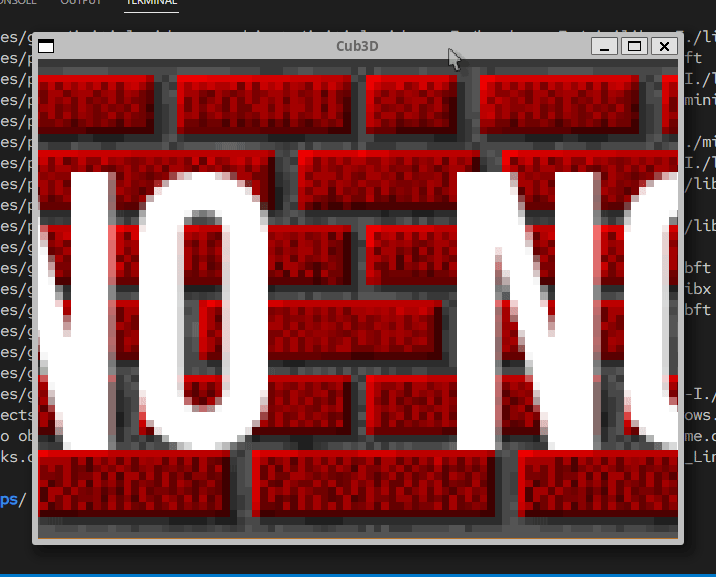

# Cub3D

<div align="center">
  
</div>  
<br/>


## What is it?
This project is inspired by the famous [Wolfenstein 3D](https://en.wikipedia.org/wiki/Wolfenstein_3D) game, which was the first FPS ever.  
A simple raycaster, made with C and utilizing a custom-made graphics library called MiniLibX, a basic wrapper for the [X Window System](https://pt.wikipedia.org/wiki/X_Window_System).  

**Succeeded with 100%**

## Skills
 - Imperative programming
 - Graphics
 - Algorithms & AI
 - Rigor


## How it works
Requirements:
```shell
# It needs X11 miscellaneous extensions library and utility functions from BSD
# Also, I recommend compiling with clang
sudo apt install libx11-dev xorg-dev libbsd-dev gcc
```

After compiling it, you'll need a map (just a text file) with the extension `.cub` with the following configuration:

- The map must be composed of only 6 possible characters: 0 for an empty space, 1 for a wall, and N,S,E or W for the player’s start position and spawning orientation. ex:

		111111
		100101
		101001
		1100N1
		111111

- The map must be closed/surrounded by walls.
- Except for the map content, each type of element can be separated by one or more empty line(s).
- Except for the map content which always has to be the last, each type of element can be set in any order in the file.
-  Except for the map, each type of information from an element can be separated by one or more space(s).
- Spaces are a valid part of the map.
- Each element (except the map) firsts information is the type identifier (composed by one or two character(s)), followed by all specific informations for each object in a strict order such as:
  - North texture:
	NO ./path_to_the_north_texture
  - South texture:
	SO ./path_to_the_south_texture
  - West texture:
	WE ./path_to_the_west_texture
  - East texture:
	EA ./path_to_the_east_texture
  - Floor color:
	F 220,100,0
  - Ceiling color:
	C 225,30,0

- The texture must be 64x64 and be in the .xpm file format.  


Full example:
 ```shell
NO ./path_to_the_north_texture
SO ./path_to_the_south_texture
WE ./path_to_the_west_texture
EA ./path_to_the_east_texture
F 220,100,0
C 225,30,0

		1111111111111111111111111
		1000000000110000000000001
		1011000001110000000000001
		1001000000000000000000001
111111111011000001110000000000001
100000000011000001110111111111111
11110111111111011100000010001
11110111111111011101010010001
11000000110101011100000010001
10000000000000001100000010001
10000000000000001101010010001
11000001110101011111011110N0111
11110111 1110101 101111010001
11111111 1111111 111111111111
 ```
The folder `maps`, has more examples.  

Then, run the binary providing the map's path.
``` sh
./cub3D <path-to-map>
```

Keyboard Keys:

	Move player: W, A, S, D
	Move camera: 🡡, 🡠, 🡣, 🡢
	Quit: ESC


## Found any bugs?
Feel free to contact me or create an issue!

## License
This project is licensed under the GNU General Public License v3.0 - see the [COPYING](https://github.com/hde-oliv/cub3D/blob/master/COPYING) file for details.
